# Backend V2 database design

Status: canonical target design for implementation planning
DDL: [`../../database/schema.sql`](../../database/schema.sql)

## Scope and ownership

PostgreSQL is the system of record for Backend V2 application data. The
application schema is `app`.

There are two deliberately separate ownership boundaries:

1. **Authentication tables managed by Better Auth.** Better Auth owns its
   generated user, session, account, verification, and plugin tables. Their
   exact schema must be generated from the pinned Better Auth version during
   implementation. They are not duplicated in `database/schema.sql`.
2. **Application-domain tables managed by this project.** Backend V2 owns all
   tables in `app`, including `application_users`, profiles, roles, centers,
   employers, workflows, content, and audit data.

`app.auth_identities` is the bridge between these boundaries. A row with
`provider = 'better_auth'` stores the Better Auth user ID in
`provider_subject`; a row with `provider = 'firebase'` stores the Firebase UID
during the transition. There is intentionally no foreign key into a
provider-owned authentication table.

Passwords, password hashes, sessions, OAuth tokens, reset tokens, and MFA
secrets must never be added to the application-domain tables.

## Entity relationship overview

```mermaid
erDiagram
    APPLICATION_USERS ||--|| USER_PROFILES : has
    APPLICATION_USERS ||--o{ AUTH_IDENTITIES : maps
    APPLICATION_USERS ||--o{ USER_ROLES : receives
    ROLES ||--o{ USER_ROLES : grants
    APPLICATION_USERS ||--o| COORDINATORS : becomes
    CENTERS ||--o{ COORDINATORS : contains

    EMPLOYERS ||--o{ EMPLOYER_CONTACTS : has
    APPLICATION_USERS o|--o| EMPLOYER_CONTACTS : provisions
    EMPLOYERS ||--o| EMPLOYER_PRIVATE_INFORMATION : protects
    EMPLOYERS ||--o| EMPLOYER_CRM_DETAILS : tracks
    EMPLOYERS ||--o{ EMPLOYER_CENTER_RELATIONSHIPS : relates
    CENTERS ||--o{ EMPLOYER_CENTER_RELATIONSHIPS : scopes
    EMPLOYER_CENTER_RELATIONSHIPS ||--o{ COORDINATOR_ASSIGNMENTS : permits
    COORDINATORS ||--o{ COORDINATOR_ASSIGNMENTS : owns
    EMPLOYERS ||--o{ COORDINATOR_ASSIGNMENTS : assigned

    COORDINATORS ||--o{ PRIVACY_REQUESTS : requests
    EMPLOYERS ||--o{ PRIVACY_REQUESTS : protects
    COORDINATOR_ASSIGNMENTS o|--o{ PRIVACY_REQUESTS : routes
    PRIVACY_REQUESTS ||--o{ PRIVACY_REQUEST_DECISIONS : records
    PRIVACY_REQUESTS ||--o| PRIVACY_ACCESS_GRANTS : creates
    COORDINATORS ||--o{ PRIVACY_ACCESS_GRANTS : receives

    CENTERS ||--o{ EVENTS : owns
    COORDINATORS o|--o{ EVENTS : organizes
    EVENTS ||--o{ EVENT_PUBLICATION_HISTORY : transitions
    EVENTS ||--o{ EVENT_MEDIA : uses
    MEDIA_ASSETS ||--o{ EVENT_MEDIA : attaches
    EVENTS ||--o{ EVENT_REGISTRATIONS : accepts
    APPLICATION_USERS ||--o{ EVENT_REGISTRATIONS : submits
    EMPLOYERS ||--o{ EVENT_REGISTRATIONS : represents
    EVENT_REGISTRATIONS ||--o| PAYMENTS : requires
    PAYMENTS ||--o{ PAYMENT_ATTEMPTS : retries
    PAYMENTS ||--o{ PAYMENT_WEBHOOK_EVENTS : receives

    APPLICATION_USERS ||--o{ NOTIFICATIONS : receives
    CONTENT_SOURCES ||--o{ ARTICLES : supplies
    CONTENT_SCRAPE_RUNS ||--o{ ARTICLES : discovers
    ARTICLES ||--o{ ARTICLE_STATUS_HISTORY : transitions
    MEDIA_ASSETS o|--o{ ARTICLES : illustrates
    MEDIA_ASSETS o|--o{ PROMOTIONAL_CONTENT_ITEMS : renders
    APPLICATION_USERS o|--o{ AUDIT_LOGS : acts
```

## Identity, profiles, and roles

### `application_users`

This is the stable application identity, not the login provider. Its UUID is
used by all application relationships. `primary_email` is case-insensitively
unique through `citext`. Status is one of `invited`, `active`, `suspended`, or
`deactivated`.

An invited application user may exist before a Better Auth account is
provisioned. This solves the current problem where a directory record and a
Firebase Auth identity are incorrectly treated as the same object.

Hard deletion is not a normal operation. Deactivation preserves foreign keys,
workflow history, payment records, and audit evidence.

### `auth_identities`

Maps an external authentication subject to one `application_users` row.

- Unique `(provider, provider_subject)` prevents one Firebase UID or Better
  Auth user ID from mapping to multiple users.
- A partial unique index permits at most one active identity for a user and
  provider while preserving retired mappings.
- `provider_email_snapshot` is reconciliation evidence, not an authorization
  key.

Authorization always uses `application_user_id` after authentication has been
resolved. Email is never used as a relational primary key.

### `user_profiles`

One-to-one with `application_users`. It contains application presentation data
such as name and locale. Authentication data and employer CRM/private data do
not belong here.

### `roles` and `user_roles`

`roles` is seeded with `admin`, `coordinator`, and `employer`. `user_roles`
stores grants and revocation history. A partial unique index prevents duplicate
active grants while allowing old revoked grants to remain as evidence.

Role membership alone is not sufficient for row access. NestJS policies also
check center, ownership, assignment, and consent.

### `centers` and `coordinators`

Centers have stable UUIDs and unique human-maintained codes/names.
`coordinators` links one application user to a center and stores only
coordinator-domain fields.

The schema currently models one active primary center per coordinator. A
multi-center coordinator requirement is an open product decision; it would
replace the direct `center_id` with a temporal relationship table.

The composite unique key `(coordinator.id, coordinator.center_id)` supports
foreign keys that structurally prevent cross-center event ownership and
coordinator assignments.

## Employers, contacts, centers, and assignments

### `employers`

Represents the company/organization, independently of any login account or
contact email. Public directory data includes names, address, classification,
description, jobs URL, and logo reference.

Important constraints and indexes:

- Non-empty display name.
- Non-negative/valid media is referenced through `media_assets`.
- A partial unique company-number index applies only to non-deleted rows.
- Directory and industry indexes support keyset pagination over active rows.

Company-name uniqueness is intentionally not enforced. The current data
contains possible duplicate or ambiguous organizations, and merge rules require
product review.

### `employer_contacts`

Represents a person associated with an employer. A contact may exist before an
account; provisioning later sets `application_user_id`. One active primary
contact per employer and one active employer-contact link per application user
are enforced by partial unique indexes.

This table is the employer ownership/membership relationship used by
`EmployerPolicy` and `RegistrationPolicy`. The browser cannot assert an
employer ID independently of the authenticated contact relationship.

### `employer_private_information`

One protected record per employer for direct email, phone/mobile, and sensitive
notes. The optional primary contact uses a composite foreign key to prove that
the contact belongs to the same employer.

This table must never be joined into a public directory serializer. Reads are
authorized and audited by `PrivacyPolicy`.

PostgreSQL/Render encryption at rest and TLS are required. Application-level
field encryption is an open security decision because it affects lookup,
deduplication, key management, and incident recovery.

### `employer_crm_details`

Separates internal relationship state and contact notes from public employer
data. Admins and the actively assigned coordinator may access it; ordinary
directory users may not.

### `employer_center_relationships`

Models the company-to-center boundary explicitly and temporally.

- Only one active relationship for the same employer/center pair.
- At most one active `primary` center per employer.
- Historical relationships are ended, not overwritten.

Additional non-primary relationships are representable, but their product
meaning must be agreed before use.

### `coordinator_assignments`

Models the current and historical employer owner. Its composite foreign keys
require:

- the coordinator to belong to `center_id`; and
- the employer to have the referenced relationship with the same center.

A partial unique index prevents more than one active coordinator assignment per
employer. Ending an employer-center relationship must also end its active
assignment in the same NestJS transaction. Cross-row “active at the same time”
logic belongs in that transaction and in policy tests.

An existing unassigned employer may not be claimed by a coordinator directly.
The recommended policy is admin assignment (or a future approved assignment
request). A coordinator may still create a brand-new employer and receive an
atomic assignment if that behavior is retained.

## Privacy model

### `privacy_requests`

A coordinator requests access to one employer's private details. The request
captures the employer's active assigned coordinator/assignment when one exists.
If no active assignment exists, employer approval alone can complete the
request. If an assignment exists, employer approval is followed by assigned
coordinator approval.

Constraints prevent:

- requester and assigned reviewer being the same coordinator;
- an assigned coordinator without the matching assignment record;
- duplicate active requests for the same employer/requester;
- a coordinator-review state without an assigned coordinator; and
- terminal states without a resolution timestamp.

The request contains a purpose and expiry. Policy checks both persisted status
and wall-clock expiry; a scheduled job changing stale rows to `expired` is
housekeeping, not the security boundary.

### `privacy_request_decisions`

Stores immutable employer and assigned-coordinator decisions separately from
the request's current state. There can be only one decision per request/stage.
NestJS verifies that the deciding user is an active employer contact or the
assigned coordinator; this cannot be truthfully expressed as a simple foreign
key.

### `privacy_access_grants`

Created atomically with an approved privacy request. The composite foreign key
proves that the source request is for the same employer and requesting
coordinator. Grants have an explicit scope, validity interval, status,
revocation actor, and reason.

A partial unique index prevents duplicate active grants for the same
employer/coordinator/scope. `PrivacyPolicy` authorizes a grant only when:

- `status = active`;
- `valid_from <= now() < expires_at`;
- the user is still an active coordinator; and
- no assignment/center change has triggered revocation.

Grant revocation and assignment changes are server-side transactions. Grants
are never physically deleted by normal application operations.

## Events, registrations, and payments

### `events`

`publication_status` is one of `draft`, `pending_approval`, `published`,
`rejected`, or `cancelled`. Archiving is deliberately orthogonal through
`archived_at`/`archived_by_user_id`. Restore clears those fields; it does not
guess or overwrite publication status.

Structural constraints enforce:

- non-empty title and description;
- `ends_at > starts_at`;
- null (unlimited) or non-negative capacity;
- non-negative price and three-letter uppercase currency;
- same-center coordinator ownership; and
- valid payment configuration.

Payment configuration is:

- `free`: zero price and no destination/provider;
- `external_link`: positive price and HTTP(S) link;
- `bit`: positive price and non-empty destination alias;
- `provider`: positive price and named server-side provider.

Only non-secret references are stored. Credentials and webhook secrets are
server environment variables.

The public upcoming, center moderation, owner, and archive indexes support the
main API paths. Events never contain registration IDs, Firebase UIDs, or a
denormalized registration count.

### `event_publication_history`

Append-only publication transitions with actor, reason, and timestamp. It is
not a substitute for `audit_logs`; it is efficient domain history for event
workflows.

### `event_registrations`

One durable row per `(event_id, registrant_user_id)` prevents duplicate
registrations. The employer foreign key records which organization the user
represented at registration time. Re-registration transitions the existing row
rather than inserting a duplicate.

The server locks the event row and evaluates capacity inside the registration
transaction. Capacity cannot safely be enforced with a static check constraint
because it depends on other rows.

For free events the server creates a `confirmed` registration atomically. For
paid events it creates `pending_payment`; only a verified webhook or explicit
admin reconciliation may confirm it.

### `payments`, `payment_attempts`, and `payment_webhook_events`

`payments` is the logical payment for a registration; at most one exists per
registration. It stores amount/currency snapshots, status, provider reference,
refund amount, and an application idempotency key.

`payment_attempts` records retries, the provider used for that attempt, and a
provider-scoped attempt reference. The provider snapshot makes webhook lookup
unambiguous if the project supports more than one payment provider.
`payment_webhook_events` deduplicates provider events and records signature
verification and processing outcome.

PostgreSQL cannot safely enforce “a confirmed paid registration has a succeeded
payment” across tables without brittle triggers. `PaymentsService` performs the
payment and registration transition in one transaction, and integration tests
prove it. Browser requests never select a successful payment state.

Webhook payloads require a documented redaction and retention policy and must
never contain card secrets.

## Notifications

`notifications` is addressed by `recipient_user_id`, not client-supplied email.
Subject fields provide non-FK links to heterogeneous workflows, while the
payload carries minimal display metadata.

Indexes support newest-first recipient pagination and unread counts. A
deduplication key prevents duplicate workflow notifications. Only backend
domain services create rows; recipients may read, dismiss, or mark their own
notifications as read.

## Content and moderation

### `content_sources`, `content_keywords`, and `content_scrape_runs`

Replace the `settings/bot_config` document and provide explicit scraper
configuration and execution history. Manual scraper runs require admin policy;
scheduled runs use a system principal. Partial source failures are retained in
the run record.

### `articles` and `article_status_history`

Articles record origin (`manual`, `scraper`, or `migration`), source/run,
author, moderation fields, and media references. A SHA-256 of the source URL
provides bounded, deterministic duplicate prevention without indexing
arbitrarily long URLs.

The state model is `draft -> pending_review -> published|rejected`, with
rejected content revisable back to draft/pending review and published content
archivable. Coordinator and scraper submissions enter `pending_review`; only an
admin publishes or rejects.

### `promotional_content_items`

Replaces `promotional_content`. A null `audience_role_id` means all
authenticated roles; otherwise the referenced role is targeted. Exactly one of
an object-storage asset or external media URL is required.

## Media assets

`media_assets` stores object metadata and references only. Binary/base64 data is
never stored in PostgreSQL.

The lifecycle is:

1. create `pending_upload` metadata and issue a short-lived presigned PUT;
2. browser uploads directly to R2;
3. API verifies object size/type/checksum with HEAD and marks `ready`;
4. referencing domain rows may use only a ready asset;
5. deletion is soft and delayed until no live references remain.

Foreign keys use `ON DELETE RESTRICT`; application cleanup marks assets deleted
and an asynchronous job removes the object after the retention window.

## Audit and migration evidence

### `audit_logs`

Append-only security/business audit containing actor, action, subject,
request/correlation ID, network metadata, and redacted before/after state.
Database grants for the API runtime role must allow `INSERT` and `SELECT` as
needed but deny `UPDATE` and `DELETE`.

Audit payload builders must exclude passwords, auth/session tokens, payment
secrets, presigned URLs, and private contact values unless a security-approved
redacted representation is required.

### `data_migration_runs` and `legacy_record_mappings`

Record migration manifests, counts, reconciliation, source document paths,
target keys, and source checksums. Their unique source mapping makes import
retries idempotent and provides traceability for rollback/reconciliation.

## Deletion and retention

- Users, employers, events, articles, and media are normally deactivated,
  archived, revoked, or soft-deleted.
- Assignment, privacy, event status, payment, and audit history is retained.
- Foreign keys default to `RESTRICT` where deletion would destroy evidence or
  create an orphan.
- Actor references may use `SET NULL` so audit/history survives exceptional
  legal deletion; actor identity snapshots remain in `audit_logs`.
- Authentication sessions follow Better Auth retention/configuration.
- Exact retention periods for private data, notifications, webhook payloads,
  audit logs, rejected content, and backups are open legal/product decisions.

## Index and query strategy

The schema indexes the access patterns required by the proposed API:

- keyset-paginated employer directory by status/name/ID;
- active coordinator/employer assignments and center relationships;
- privacy inboxes by employer, requester, assigned coordinator, status, and
  expiry;
- upcoming published events, scoped moderation queues, ownership, and archive;
- event/user/employer registration lists;
- payment status, attempts, provider references, and unprocessed webhooks;
- recipient notification feed/unread rows;
- article publication and moderation feeds; and
- audit lookups by subject, actor, and request.

Every list endpoint still requires a bounded limit. Additional indexes are
added only after reviewing real `EXPLAIN (ANALYZE, BUFFERS)` output.

## Drizzle compatibility

The design is representable in Drizzle PostgreSQL tables and migrations.
Implementation notes:

- Use `pgSchema('app')`, `pgEnum`, `uuid().defaultRandom()`, `numeric`,
  `timestamp({ withTimezone: true })`, `jsonb`, and explicit `foreignKey`
  declarations.
- Represent `citext` with a reviewed Drizzle custom type, or keep the column in
  a custom SQL migration while exposing it as string.
- Name expression and partial indexes explicitly and use Drizzle SQL predicates.
- Composite foreign keys for center-safe assignments and privacy source
  integrity require explicit `foreignKey({ columns, foreignColumns })`.
- `CREATE EXTENSION`, `COMMENT ON`, and database-role grants are best kept in
  reviewed custom SQL migrations.
- Drizzle Kit `generate`/`migrate` is preferred for production. Do not use
  `drizzle-kit push` against staging or production.
- Better Auth's Drizzle schema must be generated from the pinned package/plugin
  set. Do not recreate the tables from this document.

For this design task, `database/schema.sql` is the architectural source. During
implementation, the baseline Drizzle schema and generated migration must be
compared against it. After that baseline is accepted, reviewed Drizzle schema
and migration files become the executable evolution history, with this document
updated whenever the model changes.

## Design-time schema validation

Validated on 2026-07-24 against a new disposable `postgres:16-alpine` database:

- `psql` executed the complete file with `ON_ERROR_STOP=1`; the transaction
  committed successfully;
- PostgreSQL created 34 `app` tables and reported 235 validated catalog
  constraints with no unvalidated constraints;
- catalog inspection confirmed the intended unique indexes for one active
  coordinator assignment per employer, one active privacy grant per
  employer/coordinator/scope, one registration per event/user, and
  provider-scoped payment-attempt references;
- a static name check found no duplicate type, table, constraint, or explicit
  index names; and
- a static creation-order check found no missing or forward table references.

The disposable container and database were removed after validation. This
validates the architectural DDL, not a future Drizzle implementation, migration
against production data, operational privileges, or PostgreSQL-version upgrade
behavior.
